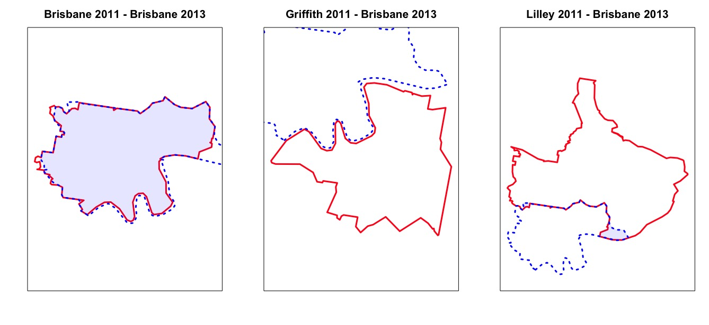

# Data {#ch:Data}

To explore the questions set out in this research, socio-demographic and voting data is needed for every federal election. 

The Census provides information about characteristics of every household in Australia, and is conducted every five years. There have been four Censuses in the 21st century, being that in 2001, 2006, 2011 and 2016. The information contained in these collections are used to build the socio-demographic profiles for each electorate, at election time.

Federal elections typically occur every three years, and those of interest are the 2001, 2004, 2007, 2010, 2013 and 2016 elections. 

All information used in this study is publicly available.

## Electorates and their boundaries

Australian Federal elections are determined based on which party wins a majority of the 150 seats in the House of Representatives, with each seat corresponding to an electorate. The electorate boundaries are determined by population, and to ensure equal representation, the boundaries of these divisions have to be redrawn regularly by the AEC. Each redistribution typically affects a handful of electorates, with most remaining the same as previously defined.

Since changes are frequently made to electoral boundaries, when it is time for a Census to be conducted, the ABS constructs an approximation to each current electorate and aggregates data at this level.

What this means is that the electorate boundaries in the election prior to a Census may not match the boundaries used in the Census, which may not match the boundaries in the following election and so on.

This presents a challenge. How does one construct socio-demographic profiles at election time for each electorate, when we cannot directly match that election with a Census?


## Census data

### Source

Data for each Census are downloaded from the ABS website as a collection of Microsoft Excel spreadsheets, with each spreadsheet corresponding to a particular electorate, or a particular question (depending on the format used in that Census year).

In order to convert the information held in these spreadsheets into a summarised table containing selected socio-demographics for each electorate, a series of R scripts and Rmarkdown files have been created. The output of each file is an R `data.frame` object, which tabulates the selected metrics for that Census year.

There was no way to automate this process, and the formats of each Census collection change slightly each year. As such, it has taken a significant amount of time and effort to extract the information from Excel, and wrangle the data into the desired metrics and format. A snippet of the raw data can be found in the Appendix \@ref(fig:excel-demo).

The resultant data frame for each election contains information for each electorate on:

- State
- Population
- Age
- Education
- Employment
- Religious and cultural identity
- Median incomes (personal, household, family)
- Median rent and loan payments
- Citizenship and birthplace
- Language at home
- Relationship status

All metrics are recorded as percentages, representing the percentage of people in that electorate who satisfy the category in question. For example, $AusCitizen$ is the percentage of people in the electorate who are Australian citizens. The population and area of each electorate is also recorded.

A full description of socio-demographic variables in the electorate profiles can be found in the Appendix \@ref(ch:appendix).


### Insights on the changing Australian demographic

Comparing Census data across years reveals many insights into how Australian demographics have changed over the past 17 years. By examining visual distributions of metrics across Census years, trends can be identified for the entire country and for the spread amongst electorates.

#### As Australians grow old, some stay young

It is well documented that Australia has an ageing population [@Rich08], and this is reflected in the age profile plots shown in Figure \@ref(fig:vis-age). Each of the selected plots displayed (called 'violin plots') suggest the shape of the distribution of the indentified age category (age 15-19, 25-34, 55-65) or median electorate age, by Census year.

Figure \@ref(fig:vis-age) shows the distribution of median age of each electorate has spread upwards over time, with some electorates in 2016 reaching a median age of 50 years. At the same time, it appears that some electorates are not ageing, as the minimum median age remains at 30 years. This makes intuitive sense, because some areas may be more suitable for particular age brackets. This is exactly the effect we see in young adults. Those aged 25-34 are more likely to congregate in common electorates, and avoid other electorates than they were in 2001 - making up 35% of the population in some electorates.

```{r vis-age, fig.asp = 0.2, fig.cap="Age profiles of Australian electorates, by Census year"}
vis_age <- vis_df %>%
  filter(measure %in% c("Age15_19", "Age25_34", "Age55_64", "MedianAge"))

ggplot(vis_age, aes(x=year, y=value, fill=year)) + geom_violin() + facet_wrap(~measure, scales = "free_y", nrow = 1) + labs(x = "Census year", y = "% of electorate") + theme(text=element_text(size=8), axis.text.x=element_text(size=6), axis.text.y=element_text(size=8))
```

#### Religion: a thing of the past?

Socially "progressive" movements continue to gather momentum all over the world, and as a result, Australia is moving away from traditional religious beliefs and values. The frequency of individuals identifying themselves with a religion has declined over the years, as shown for various religions in Figure \@ref(fig:vis-relig). This effect has stretched across (what appears to be) every electorate, as seen in the fourth panel. Having any religious affiliation would make you a minority in some electorates! At the same time, particular electorates maintain relatively large representation of certain otherwise uncommon religious group, as seen by the thin upper tails of the Islam and Judaism metrics.

```{r vis-relig, fig.asp = 0.2, fig.cap="Religion profiles of Australian electorates, by Census year"}
vis_relig <- vis_df %>%
  filter(measure %in% c("NoReligion", "Christianity", "Islam", "Judaism"))

ggplot(vis_relig, aes(x=year, y=value, fill=year)) + geom_violin() + facet_wrap(~measure, scales = "free_y", nrow = 1) + labs(x = "Census year", y = "% of electorate") + theme(text=element_text(size=8), axis.text.x=element_text(size=6), axis.text.y=element_text(size=8))
```


#### Investing in education

Australia has seen improvements in education outcomes across the board, experiencing continual increases in secondary and tertiary completion rates across the years (Figure \ref(fig:vis-educ)). It is encouraging to see that no electorates appear to be lagging behind, as the minimum values increase each year for all levels of education.

```{r vis-educ, fig.asp = 0.2, fig.cap="Education profiles of Australian electorates, by Census year"}
vis_educ <- vis_df %>%
  filter(measure %in% c("HighSchool", "Bachelor", "Postgraduate", "CurrentlyStudying"))

ggplot(vis_educ, aes(x=year, y=value, fill=year)) + geom_violin() + facet_wrap(~measure, scales = "free_y", nrow = 1) + labs(x = "Census year", y = "% of electorate") + theme(text=element_text(size=8),axis.text.x=element_text(size=6),axis.text.y=element_text(size=8))
```


Further violin plots for the complete set of variables in the electorate profiles can be found in the Appendix (see Figures \@ref(fig:vis-census1),\@ref(fig:vis-census2),\@ref(fig:vis-census3),\@ref(fig:vis-census4)).

##### A note on Census non-response

Like in any survey, non-response bias is a source of potential problems. ABS statements released with each Census assure a high quality of data collection, and this study assumes its reliability.

Non-response for key variables is imputed by the ABS (age, sex, martial status and usual residence) for 2006, 2011 and 2016, although is not clear whether this has been done in 2001. Non imputed items are treated as "not stated" or "not applicable".

No adjustments or imputations are made in this study to the values derived from each Census. However, the frequency of "not stated" responses will be recorded for particular questions, and are included with other Census-derived metrics in the electorate profiles.


## Elections

Within each electorate, candidates from various political parties run for election to represent that electorate. Voting is compulsory in Australia, and the winning candidate is determined by preferential counts. This means that each person assigns a numbered preference to each candidate, and the winner is determined by receiving a majority of preference votes.

At the end of tallying the first round of preferences, if there is no majority, the party with the least votes will have its first preference vote distributed to the parties that voters had selected as their second preference. This is continued until a party receives an absolute majority of votes.

The three types of vote counts are published for each federal election, and are as follows.

- Division of preferences: distribution of preferences at each step of reallocation, beginning with first preferences.
- Two party preferred: distribution of preferences where, by convention, comparisons are made only between Labor and Liberal/National candidates.
- Two candidate preferred: distribution of preferences to the two candidates who came first and second in the election.

For this study, the two party preferred and division of preferences outcomes are used to answer research questions (1), (2) and (3). These can be downloaded directly from the AEC website, and have been compiled and stored in $R$ data.frames, using the same method as described for the Census data.

## Mapping socio-demographic profiles to election times

The elections and Censuses have different frequencies, occuring every three and five years respectively. This naturally leads to a significant challenge, as socio-demographic information is needed for each electorate at election time, but often electorate boundaries change between a Census and an election. A timeline of elections and Censuses is shown in Figure \@ref(fig:timeline).

There are two cases to consider in connecting socio-demographic information from a Census to an election:

- Election falls on a Census year

- Election does not fall on a Census year

```{r timeline, fig.cap="Timeline of Australian elections and Censuses", out.height="30%", fig.align="center"}
timeline <- data.frame(year = c(2001:2016)) %>%
  mutate(election = ifelse(year %in% c(2001, 2004, 2007, 2010, 2013, 2016),1,0),
         census = ifelse(year %in% c(2001, 2006, 2011, 2016), 1.4, 0)) %>%
  gather(c(election,census), key = event, value = measure) %>%  filter(measure != 0) %>%
  mutate(year_vis = ifelse(event == "census", year + 0.1, year))


ggplot(timeline, aes(x=year_vis, y=measure)) + geom_point(aes(color=as.factor(event),shape=as.factor(event)),size = 4) + labs(color = "Event", shape = "Event") + geom_hline(yintercept=0, size =1, color = 'grey', show.legend = FALSE) + geom_segment(x=2001,xend=2001, y=1, yend=0, color = '#00BFC4') + geom_segment(x=2004,xend=2004, y=1, yend=0, color = '#00BFC4') + geom_segment(x=2007,xend=2007, y=1, yend=0, color = '#00BFC4') + geom_segment(x=2010,xend=2010, y=1, yend=0, color = '#00BFC4') + geom_segment(x=2013,xend=2013, y=1, yend=0, color = '#00BFC4') + geom_segment(x=2016,xend=2016, y=1, yend=0, color = '#00BFC4') + geom_segment(x=2001.1,xend=2001.1, y=1.4, yend=0, color = '#F8766D') + geom_segment(x=2006.1,xend=2006.1, y=1.4, yend=0, color = '#F8766D') + geom_segment(x=2011.1,xend=2011.1, y=1.4, yend=0, color = '#F8766D') + geom_segment(x=2016.1,xend=2016.1, y=1.4, yend=0, color = '#F8766D') + labs(x="Year") + theme(text=element_text(size=8), axis.text.x=element_text(size=6),axis.text.y=element_blank(), axis.title.y=element_blank(), plot.background=element_blank(), axis.ticks.y = element_blank(), panel.background = element_blank()) + scale_x_discrete(limits = c(2001:2016))
```

### Elections that fall on a Census year

When a Census is conducted in an election year the electorate boundaries used by the ABS match the AEC electoral divisions for that election, so the Census profiles for each electorate can be directly mapped to the election time. This is done by for years 2001 and 2016.

### Elections that do not fall on a Census year

If the election does not fall on the same year a Census is conducted, two problems arise:

- Electorate boundaries may not match any of the neighbouring Censuses

- Demographics may have changed since the last Census was conducted

This study proposes an innovative projection algorithm using GIS maps, $k$-centroid mapping, for imputing the demographic profiles for each election, accounting for both the time of the election and the boundaries in place. The use of GIS maps to overlay data from multiple sources is a dominant approach in spatial studies, which provides the foundation for $k$-centroid mapping.

It is worth noting that, on average, approximately 20% of division boundaries change by 25% or more between Census and election times, so directly allocating Census information from a Census electorate to an election electorate may ultimately lead to invalid results. This provides further motivation for $k$-centroid mapping. 

## K-centroid mapping

For the purpose of illustrating the algorithm, "division" will be used instead of "electorate".

$k$-centroid mapping is a method of imputing Census demographics for divisions in place at the time of an election.

Using tools predominantly from the *rgeos* package, each division boundary at election time is superimposed on top of the divisions at a particular Census time to determine which of the Census divisions intersect with the superimposed boundary. $k$ is the number of nearest Census divisions that each election boundary is superimposed onto. Census divisions are ordered by the proximity relative to the election boundary, so $k=1$ would determine the intersection between the election boundary, and the closest Census division. Selecting the number of divisions for intersection is done to reduce the computational burden.

For each division that intersects the boundary, its area of intersection with the superimposed boundary is computed. These areas are used to impute the composition of the population that sits within the election boundary, where each person is characterised by the socio-demographics of their Census division. 

A weighted average of demographics from the intersecting Census divisions is then used to impute a socio-demographic profile of the given election boundary. This is done for every election division, and the process is repeated for the other Census relevant to the election period. Interpolating between the two Censuses, based on the length of the time interval between the Census and the election, yields the final imputed profiles.

The $k$-centroid mapping algorithm for imputing the socio-demographic profiles for divisions defined at the time of an election is as follows:

1. Select the Censuses that occur immediately before and after election time. For example, to map the 2013 Federal election profiles, we would select the Censuses from 2011 and 2016.

2. Simplify the GIS maps for the division boundaries for each of these two Censuses, and the election.

Using `gSimplify()` from the *rgeos* package, we reduce the size of the maps (by reducing the number of points) to decrease the computational burden. This step is not necessary but helps the processing of large maps.

3. For each map, calculate the centroid of each division.

A centroid is the most central point of a polygon, and it takes the coordinates of average latitude and average longitude (of that polygon). Euclidean distance is used.

4. Select an election division and create a map containing the $k$ Census divisions having the centroids closest to that of the election division. 

To illustrate this and subsequent steps, consider the division "Brisbane" from the 2013 election. The polygon for its boundaries is shown in Figure \@ref(fig:bris-k3) by the dotted blue line, with the boundaries of the closest $k = 3$ divisions from the 2011 Census shown in red.

Note: $k = 3$ is chosen here to illustrate how the algorithm functions. The selection of $k$ depends on the properties of the two maps. We see here that $k = 3$ is a sufficient choice, because there do not appear to be parts of the 2013 division that sit outside of the 3 nearest divisions, but this may not be the case for other 2013 divisions. For this study, $k=35$ is chosen due to the variation in the sizes of the divisions, as a neighbouring division can be very large and have a distant centroid.

```{r bris-k3, fig.align='center', fig.cap="Brisbane (2013) and the k=3 closest Census (2011) divisions.", message=FALSE, warning=FALSE, out.width="70%"}
plot(cens_bris_poly, border = rgb(1, .1, .1), lty=1, lwd=1, ylim = c(-27.53, -27.28), xlim = c(153,153.102)) +
  plot(cens_grif_poly, border = rgb(1, .1, .1), lty=1, lwd=1, add = TRUE) +
  plot(cens_lill_poly, border = rgb(1, .1, .1), lty=1, lwd=1, add = TRUE) +
  plot(elec_poly, border = rgb(0, 0, 1, 1), lty = 2, lwd=2, add = TRUE) + box() -> junk
```


5. For each of the $k$ closest Census divisions, determine the area of intersection with the given election division.

Continuing with Brisbane from 2013, we see the area of overlap for each of the Brisbane, Griffith and Lilley divisions from the 2011 Census, given by the shaded blue region given by the panels of Figure \@ref(fig:bris-ints).

In general, this would be done between the Brisbane (2013) and every one of its $k$ nearest 2011 divisions.

```{r bris-ints, fig.align='left', out.width="100%", out.height="28%", fig.cap="Intersection of Brisbane (2013) and nearby Census divisions (2011)"}

```

6. Calculate the number of people each intersection represents, according to Census volume.

Figure \@ref(fig:bris-ints) shows that the shaded intersection areas are pieces of the respective 2011 Census divisions. The intersection of the Census divison Lilley (2011) and election division Brisbane (2013) is a small region, shown on the right panel, representing $2.22\%$ of the total area in Lilley. 

The population of Lilley (2011) is $145,652$, so the population captured by the shaded area is $3,233$. Here we assume population is equally spread throughout each division.

Let $AI_w$ denote the area contained in the intersection of Census division $w$ with the relevant superimposed election boundary, $P_w$ denote the population of division $w$ contained within that area, $A_w$ be the total area of Census division $w$ and $T_w$ be the total population of Census division $w$.

Then the population of a Census division attributed to the election boundary is given by:
$$P_w = \frac{AI_w}{A_w} \cdot T_w$$
So the population in the Census division for Lilley (2011) that is attributed to the election boundary for Brisbane (2013) is:
$$P_{Lill} = \frac{AI_{Lill}}{A_{Lill}} \cdot T_{Lill} \\ = 0.222 \cdot 145,652 \\ \approx 3233$$

The intersection of Brisbane and Brisbane equates to 99.00% of the 2011 Brisbane division. Brisbane (2011) has a population of $145,051$, so intersection represents approximately $143,602$ people. There is no overlap with Griffith (2011).

7. Determine the socio-demographic profile based on the people in each intersection, where each person assumes the demographic composition of their Census division.

To impute each socio-demographic statistic for the Brisbane division (2013), we take a weighted average of the Census demographics, using the intersection populations, $P$, as weights (as derived in Step 6).

Most socio-demographic variables availabe in a given Census division have values that may be expressed as a percentage of the number of people counted in that division. A weighted average of these percentages, each taken from the $k\text{-}centroid$ nearest Census divisons, is used to represent the percentage value for a given electoral division at the time of the Census.

For example, the percentage of people who identified as being Australian citizens for the superimposed Brisbane (2013) election boundary is calculated using a weighted average of the corresponding Census percentages from Lilley and Brisbane.

Let $C_{s,t}$ be a percentage value of a socio-demographic variable in Census divison $s$ at time $t$.

$$\hat{C}_{Bris,Election} = \frac{C_{Bris,Census} \cdot P_{Bris} + C_{Lill,Census} \cdot P_{Lill}}{P_{Bris} + P_{Lill}}$$

8. Repeat steps 4-7 for each of the 150 election division.

9. Interpolate between the Censuses by year to impute the socio-demographic division profile for the election year.

The 2013 election sits two years after the 2011 Census, and three years before the 2016 Census. Take a weighted average of each demographic across time points for each division.

Adding a subscript $y$ to $C_{s,t}$ to denote year, $C_{s,t,y}$.

$$\hat{C}_{Bris,Election,2013} = \frac{2}{5} \cdot \hat{C}_{Bris,Election,2011} + \frac{3}{5} \cdot \hat{C}_{Bris,Election,2016}$$


